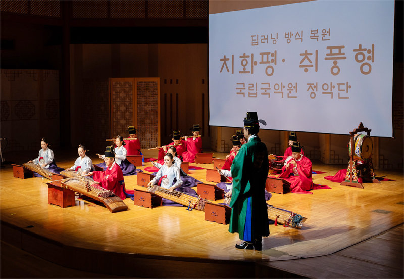

# Six dragons fly again: Reviving 15th-century Korean court music with transformers and novel encoding (ISMIR 2024)

This is the official code repository for our ISMIR 2024 [paper](https://arxiv.org/abs/2408.01096). 

The Court Music Orchestra of the National Gugak Center performed our generated Chihwapyeong and Chwipunghyeong on the birth anniversary of King Sejong at Gyeongbokgung Palace on May 14th, 2024. They performed it again at the National Gugak Center on June 2nd, 2024. 



[Performance Video1](https://www.youtube.com/watch?v=7zS1FSG7dcg)

[Performance Video2](https://youtu.be/LoU4hnCpcfA)

----

## Jeonggan-bo
Jeongganbo was created by the King sejong in the 15th century and has been used to notate Korean court music ever since. We have constructed a dataset of 85 pieces by applying optical musical recognition (OMR) to all compositions available within the manuscripts published by the National Gugak Center. You can check the original image of Jeonggan-bo [here](https://www.gugak.go.kr/site/program/board/basicboard/list?boardtypeid=12&menuid=001003002002).

----

## Interactive Web Demo
You can generate Korean traditional orchestra music with your own melody through our interactive web [demo](https://www.six-dragons-fly-again.site/).


----

## Dataset
The dataset created for this project is uploaded in `music_score/Jeongganbo_dataset.zip', which consists of 91 pieces of Jeongganbo music scores. 

----
## Requirements

We used pipenv for our virtual environments. To install the required packages, run the code below. 

```
pipenv install
```

If you are using other virtual environments, you can install the required packages by running the code below.
```
pip install -r requirements.txt
```

----

## Training

First, unzip the dataset using the code below.

```
unzip music_score/Jeongganbo_dataset.zip -d music_score/
```

To train an Encoder-Decoder Transformer for generating orchestral parts, run the code below.
```
python3 train.py
```

To train a BERT-like Transformer for melody infilling, run the code below.
```
python3 train.py --config-name=bert 
```

Since the training log is saved via `wandb`, `general.make_log` is set to False. If you want to log on wandb, add `general.make_log=True` while running the `train.py`.

--

## Inference

The pretrained model can be downloaded using `gdown` by running the code below.

```
gdown 18S-ET4ilZiDIm5xF_9xABg3Zlslek_vj
unzip model_weights.zip
```

To infill the melody of a given melody, run the code below.

```
python3 generate_bert.py --input_fn=music_score/chwipunghyeong_gen.txt --output_fn=gen_results/chwipunghyeong_infilled.txt
```

To generate orchestral parts for a given melody, run the code below.

```
python3 generate_ensemble.py --input_fn=gen_results/chwipunghyeong_infilled.txt --output_fn=gen_results/chwipunghyeong_ensemble.txt
```

The generated music will be saved in the parent of `output_fn`. Six files will be saved:
- `output_fn_gen.txt`: The generated orchestration in JG-like encoding
- `output_fn_omr.txt`: The generated orchestration converted to encoding scheme of Jeongganbo OMR, which can be used for Jeongganbo notation rendering.
- `output_fn_gen.musicxml`: The generated orchestration in MusicXML format.
- `output_fn_cycle`: The result after the refinement process.

----
## Citation
To cite our work, please use the following bibtex entry:

```
@inproceedings{sixdragons2024,
  title={Six dragons fly again: Reviving 15th-century Korean court music with transformers and novel encoding},
  author={Han, Danbinaerin and Gotham, Mark and Kim, Dongmin and Park, Hannah and Lee, Sihun and Jeong, Dasaem},
  booktitle={Proceedings of 25th International Society for Music Information Retrieval Conference (ISMIR)},
  year={2024}
}
```